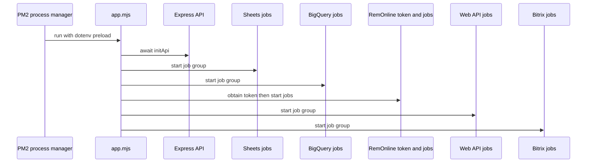

# Runtime architecture

`app.mjs` is the production composition root. It awaits `initApi()`, starts Sheets and BigQuery jobs, obtains a RemOnline token before starting RemOnline jobs, then starts Web API and Bitrix jobs. The PM2 configuration runs this file with dotenv preloaded. This coupling means a normal deployment brings up both the HTTP service and all enabled schedulers in one Node process.

This shows the enabled startup order implemented by `app.mjs`; individual job cadences are defined beside their job modules.

## HTTP surface

`src/api/api.mjs` builds an Express application with JSON parsing, mounts the core router at `/`, and listens on `API_HOST:3000`. The core router adds request logging, then dispatches to:

| Route area | Local protection | Responsibility | Source |
| --- | --- | --- | --- |
| `/bolt/letters/*` | `authorizationMiddleware` | Bolt letter callbacks and approval operations | `src/api/modules/bolt/bolt.route.mjs` |
| `/query` | `authorizationMiddleware` | Runs a submitted SQL query through the source PostgreSQL query service | `src/api/modules/query/query.route.mjs` |
| `/referral-add`, `/referral-validation`, `/referral-approval` | no router-local middleware visible | Referral creation, validation, and approval actions | `src/api/modules/referrals/referrals.route.mjs` |
| fallback `/` | none | Core greeting handler | `src/api/core/core.route.mjs` |

The authorization middleware accepts `api_key` from the query string or `Authorization` header and compares it through `authorizeAPIClient`. It logs the supplied key on failed authorization, so avoid passing credentials in URLs where they may be captured by infrastructure logs. The referral routes are mounted without this middleware; treat whether they are protected upstream as an open security question, not an assumed guarantee. The [operations runbook](../operations/runbook.md) records this as a pre-deployment review point.

## Scheduler composition

Each domain bootstrap imports `CronJob` instances and calls `.start()` on them. The groups are not independent processes or queue consumers:

- `src/sheets/bootstrap.mjs` starts Google Sheets synchronization for driver and autopark cash-block exclusions. The plan job remains commented out.
- `src/bq/bootstrap.mjs` starts fleet income/expense and Poland bookkeeping report jobs.
- `src/remonline/bootstrap.mjs` starts SID/order lifecycle work plus postings, products, cashboxes, transactions, refunds, UOMs, employees, assets, orders, branches, and transfers.
- `src/web.api/bootstrap.mjs` starts contractor/revenue jobs, GDC reports, inflow/outflow reporting, repair/accident reporting, Polish deal reporting, and driver cash-block automation.
- `src/bitrix/bootstrap.mjs` starts CRM deal/contact/revenue, recruiting, referral, debt, Bolt, branding, debtor-card, and insurance-invoice jobs.

These workers implement the business behavior described in [synchronization and reporting workflows](../workflows/sync-and-reporting.md), and their clients/stores are defined in [API and connected systems](../integrations/api-and-systems.md). Bootstrap-level error handling stops and recursively restarts groups after synchronous startup errors; it is not a durable job queue or a distributed locking system.

## Persistence boundaries

The service deliberately spans multiple stores:

| Store | Purpose | Main access layer |
| --- | --- | --- |
| Local SQLite | Legacy operational state such as tokens, chat/autopark settings, and older tracking tables | `src/shared/sqlite.mjs`, legacy `migrations/` |
| Source PostgreSQL | CRM operational data queried by API, reports, and many jobs | `src/api/pool.mjs` and SQL in `src/sql/` |
| RemOnline PostgreSQL | Prisma-managed replica of RemOnline entities and synchronization state | `prisma/schema.remonline.prisma` |
| Bitrix PostgreSQL | Prisma-managed insurance invoice data and synchronization metadata | `prisma/bitrix/schema.prisma` |
| BigQuery | Published operational and finance reporting | `src/bq/` and reporting modules |

The [API and connected systems](../integrations/api-and-systems.md) page explains the ownership of these boundaries. In particular, `EntitySync` in the RemOnline schema stores JSON synchronization cursors; workflows must update records and their high-water mark atomically where the implementation does so.

## Change guidance

- Change `app.mjs` only when changing process composition. A new bootstrap affects production startup, not just a feature module.
- Put endpoint routing and authorization decisions under `src/api/`; review route-local middleware whenever adding a mutating callback.
- Add scheduled work to its domain bootstrap and a narrowly scoped job module. Account for repeat execution, partial failures, time zones, and overlapping runs.
- Add/modify persistent RemOnline or Bitrix models through the matching Prisma schema and migration workflow in the [operations runbook](../operations/runbook.md), not the legacy SQLite migration command.
