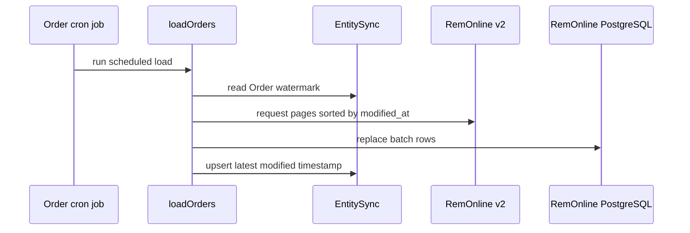

# Synchronization and reporting workflows

The cron groups registered by the [runtime architecture](../architecture/overview.md) implement the operational behavior of this repository. They fetch provider data, write to a domain store or reporting destination, and in several cases create or update CRM records or provider-side controls.

## RemOnline operational synchronization

`src/remonline/bootstrap.mjs` starts jobs for SIDs, order state, postings, products, cashboxes and transactions, refunds, units of measure, employees, assets, orders and items, branches, and transfers. The newer PostgreSQL-backed syncs use the RemOnline Prisma schema.

The order loader is the clearest example of the incremental pattern:

The diagram represents `src/remonline/modules/load-orders.mjs`: up to 50 fetched pages are accumulated; each persisted batch deletes matching order IDs, creates mapped rows, and updates `EntitySync` in one Prisma transaction. The loader logs and catches failures rather than rethrowing them. Order items run as a related but separate workflow; failed item IDs are retained for retry.

**Change implications**

- `EntitySync` is required state, not optional initialization. `getEntitySync` intentionally treats a missing row as a deployment/configuration issue.
- Watermark correctness depends on the source's boundary semantics and ordering for equal `modified_at` values. Preserve or explicitly test those assumptions when changing pagination, sorting, or update order.
- A manual script using `ENV=TEST` may still call RemOnline and write PostgreSQL. Use the checks in the [engineering change guide](../engineering/change-guide.md).

## Fleet finance and bookkeeping reports

BigQuery starts two scheduled report families: fleet income/expenses and Poland bookkeeping (`src/bq/bootstrap.mjs`). Their sources are SQL files under `src/sql/`; loader modules transform or reload data in BigQuery.

- **Fleet income and expenses** builds categorized financial reporting from calculated statements and cashbox transactions. The module reloads a recent rolling range rather than treating historical data as immutable.
- **Poland bookkeeping** derives scheduled/billable driver and vehicle periods and applies autopark, vehicle-model, owner-account, and date-specific rules. Its configuration is embedded in `src/bq/modules/generate-and-save-poland-bookkeeping-report.mjs`, which makes source review essential for any business-rule change.
- **GDC and operational reports** in `src/web.api/gdc-report/` calculate working-driver history, mileage/hours, firing, car-usage, and related reporting data. Recent SQL history changed mileage sourcing and date filtering, so validate query semantics rather than only formatting SQL.
- **Inflow/outflow reporting** writes car-transfer acceptance and scheduled-driver data through `src/web.api/inflow-outflow-drivers-report/`.

These reporting workflows share infrastructure with the [connected systems guide](../integrations/api-and-systems.md) but are operationally different from the public HTTP API: they are scheduled data refreshes. For rollback and production deployment controls, see the [operations runbook](../operations/runbook.md).

## Driver controls and CRM automation

The Web API and Bitrix groups implement fleet lifecycle and control workflows.

| Workflow                       | Behavior                                                                                  | Source area                                                                      |
| ------------------------------ | ----------------------------------------------------------------------------------------- | -------------------------------------------------------------------------------- |
| Driver revenue and contractors | Syncs contractor lists and driver revenue for CRM/reporting use                           | `src/web.api/jobs/`, `src/bitrix/jobs/`                                          |
| Driver cash-block rules        | Selects eligible drivers, applies/removes cash-block rules, and persists applied rule IDs | `src/web.api/modules/driver-cash-block-rules.mjs`                                |
| Recruitment and referrals      | Creates/synchronizes leads and deals, manages referral payment and closed states          | `src/bitrix/bootstrap.mjs`, `src/api/modules/referrals/`                         |
| Driver lifecycle               | Handles fired-driver, new-working-driver, debtor, DTP-debt, and branding workflows        | `src/bitrix/bootstrap.mjs`                                                       |
| Bolt bans                      | Moves Bitrix ban requests and accepts Bolt-related HTTP callbacks                         | `src/bitrix/jobs/move-bolt-driver-ban-requests-job.mjs`, `src/api/modules/bolt/` |
| Insurance invoices             | Incrementally synchronizes invoice records and sync metadata                              | `src/bitrix/modules/sync-insurance-invoices.mjs`                                 |

Cash-block, CRM, and provider mutations are business-impacting. Treat any `test:*` or manual invocation as a production-affecting operation until the called module is inspected. The [API and connected systems guide](../integrations/api-and-systems.md) identifies the inbound routes that can trigger related Bitrix changes.

## Removed workflows

Current source no longer includes custom tariff and custom bonus processing. The latest major refactor deleted their SQL, job files, Web API modules, bootstrap registrations, and related package scripts. This is a deliberate removal, not a missing implementation. The [engineering change guide](../engineering/change-guide.md) records the relevant history signal; avoid recreating this behavior without a new confirmed requirement.
